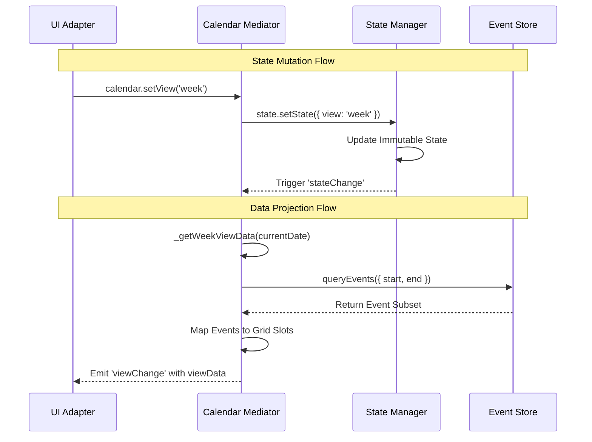
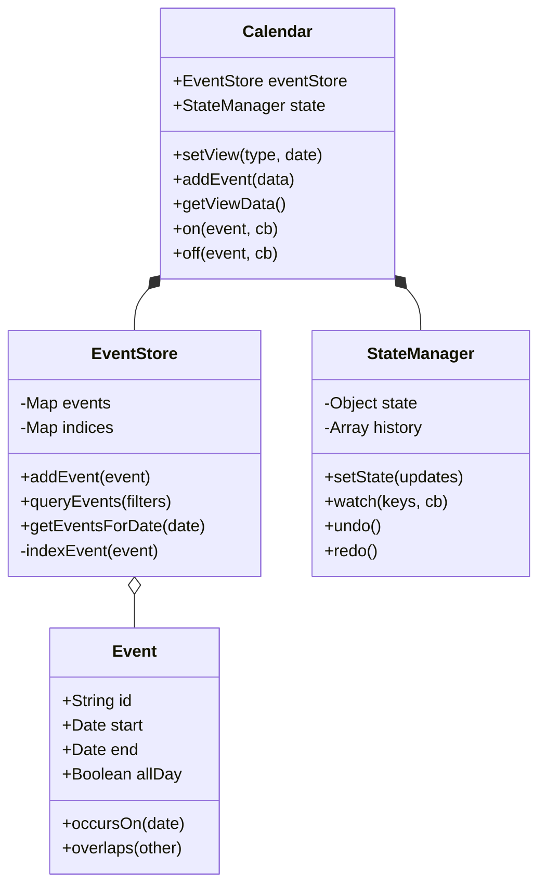

# Lightning Calendar - Technical Architecture Deep-Dive

This document provides an exhaustive technical specification of the Lightning Calendar core engine, focusing on data structures, algorithmic complexity, and state synchronization patterns.

---

## 1. Core Engine: Architectural Patterns

The engine utilizes a **Mediator Pattern** combined with **Observable State** to maintain strict decoupling between data management and UI representation.

### A. The Mediator (`Calendar.js`)
The `Calendar` class acts as the central mediator. It encapsulates the interaction between the `EventStore` and `StateManager`.

**Technical Implementation:**
- **Event Bus**: Implements a custom `Pub/Sub` mechanism to avoid `EventEmitter` dependencies.
- **Plugin System**: Uses a `Set` to manage middleware/plugins, allowing external logic to hook into the lifecycle via an `install(calendar)` method.

### B. Observable State (`StateManager.js`)
The state is managed as a single immutable tree.

**Technical Implementation:**
- **Update Mechanism**: Uses a `setState(updates)` pattern similar to React. It performs a shallow merge but preserves nested objects like `filters` and `businessHours`.
- **Dirty Checking**: Implements a `_hasChanged(old, new)` method using `JSON.stringify` (or shallow comparison) to prevent unnecessary notification cycles.
- **History Stack**: Maintains a `history` array and `historyIndex` to support **Undo/Redo** operations out of the box.

### C. Spatial Event Indexing (`EventStore.js`)
To achieve high performance with thousands of events, the `EventStore` avoids linear array searches.

**Data Structures:**
- **Primary Map**: `Map<ID, Event>` for O(1) access.
- **Date Index**: `Map<DateString, Set<ID>>`. When querying a day, the engine performs a single Map lookup.
- **Month Index**: `Map<YYYY-MM, Set<ID>>`. Used for high-level filtering.
- **Recurring Set**: `Set<ID>` for events that require the `RecurrenceEngine` (Phase 4).

**Algorithmic Complexity:**
- **Insertion**: O(D) where D is the number of days the event spans.
- **Query (Single Day)**: O(1) lookup + O(E log E) sort, where E is events on that day.
- **Query (Range)**: O(R) where R is the number of days in the range.

---

## 2. Data Flow & State Synchronization

The system utilizes a **Reactive Pull** model for rendering.

---

## 3. View Projection Logic (`viewData`)

The `viewData` is a **ViewModel** projection. It transforms raw event data into a structure optimized for iterative rendering (e.g., LWC `template for:each`).

### Month View Algorithm:
1.  Calculate `startDate` by finding the start of the week for the 1st of the month.
2.  Determine `maxWeeks` (usually 6 for fixed-height calendars).
3.  Iterate 42 times (6 weeks * 7 days).
4.  For each iteration:
    -   Perform `EventStore.getEventsForDate(currentDate)`.
    -   Calculate metadata: `isToday`, `isCurrentMonth`, `isWeekend`.
    -   Increment `currentDate`.

---

## 4. Salesforce Lightning & Locker Service Constraints

The architecture is specifically hardened for the Salesforce environment:

| Constraint | Implementation Strategy |
| :--- | :--- |
| **No `eval()`** | All logic is pure JS; no dynamic code execution. |
| **Shadow DOM** | Styles are encapsulated; `viewData` provides all necessary classes for the adapter to apply. |
| **Locker Proxy** | Avoids direct `window` access; uses `Intl` for localization which is Locker-safe. |
| **Memory Management** | `Calendar.destroy()` explicitly clears `Map` and `Set` references to prevent memory leaks in long-running SPA sessions. |

---

## 5. Class Diagram (Technical)

